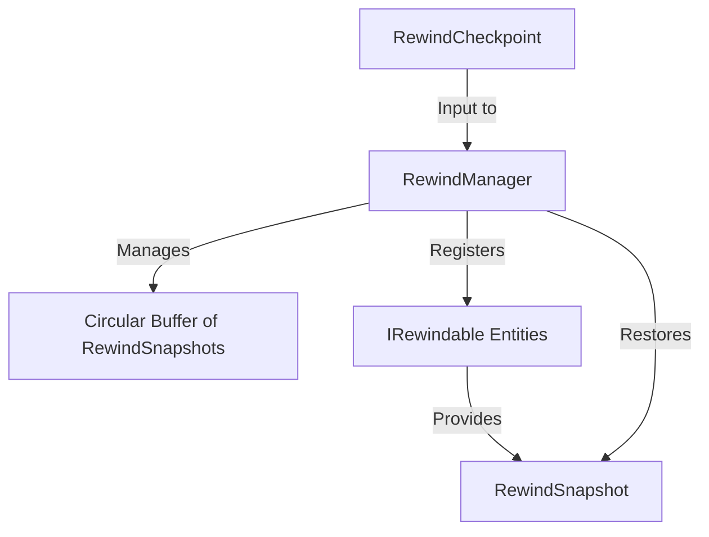

# RewindManager Technical Implementation Spec

## 1. Architecture Overview


## 2. RewindSnapshot Struct
```csharp
[Serializable]
public struct RewindSnapshot
{
    public Vector3 Position;
    public Vector2 Velocity; // Velocity taken at START of FixedUpdate
    public Quaternion Rotation;
    public int AnimationStateHash;
    public float AnimationTime;
    public float Health;
    public int EntityStateEnum;
    public bool IsActive;

    // Physics tolerance: +/- 0.05 Unity units
    public Vector3 PhysicsCorrection;
}
```

## 3. IRewindable Interface
```csharp
/// <summary>
/// Interface for any entity that can be rewound by the RewindManager.
/// </summary>
public interface IRewindable
{
    /// <summary>
    /// Gets a unique ID for the entity to track it in the buffer.
    /// </summary>
    int GetRewindableId();

    /// <summary>
    /// Captures the current state of the entity.
    /// </summary>
    RewindSnapshot CaptureState();

    /// <summary>
    /// Restores the entity to a previously captured state.
    /// </summary>
    void RestoreState(RewindSnapshot snapshot);
}
```

## 4. RewindManager Class Spec
- **Public API:**
-   - `void RegisterRewindable(IRewindable entity)`
    -   - `void StartRewind()`
        -   - `void StopRewind()`
            -   - `void SetCheckpoint(RewindCheckpoint checkpoint)`
                - - **Private Data Structures:**
                  -   - `CircularBuffer<Dictionary<int, RewindSnapshot>> _buffer`
                      -   - `int _maxFrames = 540` (9 seconds at 60fps)
                          - - **Key Methods Pseudocode:**
                            - ```csharp
                              void FixedUpdate() {
                                  if (IsRewinding) {
                                      TickRewind();
                                  } else {
                                      CaptureFrame();
                                  }
                              }

                              void CaptureFrame() {
                                  var frameData = new Dictionary<int, RewindSnapshot>();
                                  foreach(var entity in _entities) {
                                      frameData[entity.GetRewindableId()] = entity.CaptureState();
                                  }
                                  _buffer.Add(frameData);
                              }

                              void TickRewind() {
                                  if (_buffer.IsEmpty || ReachedCheckpoint()) {
                                      StopRewind();
                                      return;
                                  }
                                  var lastFrame = _buffer.PopBack();
                                  foreach(var entity in _entities) {
                                      if (lastFrame.TryGetValue(entity.GetRewindableId(), out var snapshot)) {
                                          entity.RestoreState(snapshot);
                                      }
                                  }
                                  // Handle Audio: pitch-shift down; SFX play in reverse at 0.5x volume
                              }
                              ```

                              ## 5. Circular Buffer Implementation Notes
                              The ring buffer uses a fixed-size array and a write pointer. When the buffer is full, the oldest snapshots are overwritten. This ensures zero GC allocations during the main loop.

                              ## 6. Entity Registration Pattern
                              Entities register themselves during `Awake()` via `RewindManager.Instance.RegisterRewindable(this)`.

                              ## 7. [Irreversible] Attribute Usage
                              Events tagged with `[Irreversible]` (e.g., boss death) must NOT be rolled back. The RewindManager respects this by checking the attribute before restoring global state flags.

                              ## 8. Known Risks and Open Questions
                              - **Memory:** 540 frames for many entities.
                              - - **Physics Jitter:** +/- 0.05 unit tolerance management.
                                - - **Room Transitions:** Rewind cannot go past the `RewindCheckpoint` set on room entry.
                                 
                                  - ## 9. Implementation Order
                                  - 1. `RewindSnapshot` and `IRewindable`.
                                    2. 2. `RewindManager` circular buffer.
                                       3. 3. Player movement rewind.
                                          4. 4. Enemies and projectiles.
                                             5. 5. Audio/Visual feedback.
                                                6. 
